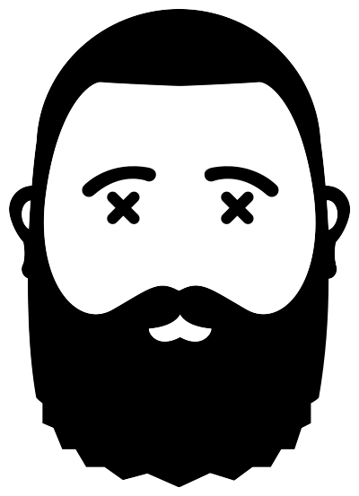

<!-- markdownlint-disable -->

	

<!-- markdownlint-enable -->

# Hi :wave: I'm Jason

- Research-driven user advocate with 18+ years of experience in digital design and full-stack development
- Empathetic designer with an eye for detail and a passion for making the web a better place 
- Versatile developer with experience in multiple web technologies
- Genuinely love the web and enjoy learning and problem solving

## Languages

<!-- markdownlint-disable -->

	
	
	
	
  
  
	
	
  

<!-- markdownlint-enable -->

## Frameworks

<!-- markdownlint-disable -->

	
  
  
	
  
  
	
	
  
	
  
  
  
  
  
  
  

<!-- markdownlint-enable -->

## Tools

<!-- markdownlint-disable -->

	
  
  
  
  
  
  

<!-- markdownlint-enable -->

## Design

<!-- markdownlint-disable -->

	
  
  
  
  
  
  

<!-- markdownlint-enable -->

---

<!-- markdownlint-disable -->

 

 
 

 
<!-- markdownlint-enable -->

---

:metal: